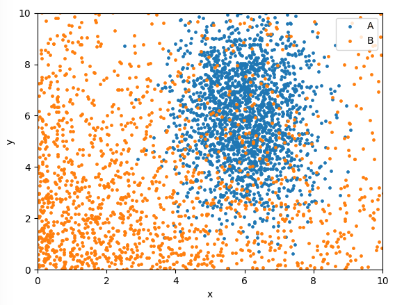

# Introduction
This article gives some examples of how using machine learning can affect the output of some stastical measurements. If unaccounted for, the use of ML algorithms may bias certain analysis, resulting in an apparently more precise measurement that is biased far away from the true result. The examples used are general, although inspired by cases found in High Energy Physics (e.g. particle classification). We'll use python and sklearn, although these affects are true for any ML. The code snippets below all form one script, which can be found in the same repo as these pages (so linked above).

# Setting the scene
Consider a typical classification problem involving two categories of event: ```A``` and ```B```. For each event, we're able to measure two features: ```x``` and ```y```. *We are trying to measure the shape of the distribution of ```x``` for category ```A``` events.*

> ## Real life example
> Say a Particle Physics experiment is interested in the energy spectrum of neutrinos. There are many types of signal that can minic a neutrino (i.e. a background), and reducing this background will increase the accuracy of the experiment. The energy spectrum of the background is typically lower than that of the neutrinos - energy it self is a useful descriminating parameter. But, as demonstrated below, using energy as a ML feature may bias the energy spectrum measured, if not accounted for correctly. 

As a demonstration, we'll randomly generate some events for the two categories based on some arbitrary typical distributions:

* Let A be distributed according to a 2D gaussian (i.e normal) distribution, with ```x``` and ```y``` not correlated.

* Let B be distribute according to exponential in both ```x``` and ```y``` (again, ```x``` and ```y``` not correlated).

Lets first look at the data generated:


