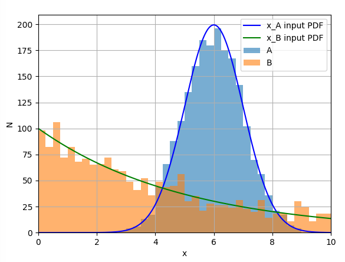

# Introduction
This article gives some examples of how using machine learning can affect the output of some stastical measurements. If unaccounted for, the use of ML algorithms may bias certain analysis, resulting in an apparently more precise measurement that is infact far away from the true result. The examples used are general, although inspired by cases found in High Energy Physics (e.g. particle classification). We'll use python and sklearn, although these affects are true for any ML in any language. The code snippets below all form one script, which can be found in the same repo as these pages (link above).

# Setting the scene
Consider a typical classification problem involving two categories of event: ```A``` and ```B```. For each event, we're able to measure two features: ```x``` and ```y```. *We are trying to measure the shape of the distribution of ```x``` for category ```A``` events.*

> ### Real life example
> Say a Particle Physics experiment is interested in the energy spectrum of neutrinos. There are many types of signal that can minic a neutrino (i.e. a background), and reducing this background will increase the accuracy of the experiment. The energy spectrum of the background is typically lower than that of the neutrinos - energy it self is a useful descriminating parameter. But, as demonstrated below, using energy as a ML feature may bias the energy spectrum measured, if not accounted for correctly. 

# Dataset

As a demonstration, we'll randomly generate some events for the two categories based on some arbitrary typical distributions:

* Let A be distributed according to a 2D gaussian (i.e normal) distribution, with ```x``` and ```y``` not correlated.

* Let B be distribute according to exponential in both ```x``` and ```y``` (again, ```x``` and ```y``` not correlated).

Lets first look at the data generated - *Fig 1*:


We're interested in the shapes of each distribution in ```x``` specifically - the next figure shows the histograms for the two populations (not stacked), with the PDFs of the functions that were originally sampled overlaid (scaled to the area of the histograms - nb these wern't fitted, since we know all the parameters a priori) - *Fig 2*:



Of course, when we do the experiment in the real world, we see something quite different, since we don't have the category labels. The full 2D data we get - *Fig 3*:


And the 1D projection in ```x``` - *Fig 4*:


# Measuring ```x_A```
## Without ML
The simplest way of finding the spectrum of ```x_A``` would be to subtract off the background ```x_B```. One could parameterise the two contributions and perform a fit, but this is sometimes not necessary in cases where the background distributions are already parameterised based on other knowledge (e.g. from trusted simulations or differet datasets).  

> ### Real life example
> Reactor neutrino experiments often go through periods where the reactor is switched off completely. Many background components in these experiments are not induced by the reactor itself, and so do not change during this transition. Since there are no neutrinos coming from the reactor in this period, the dataset recorded is purely background, thus allowing the shape of the background to be measured for subtraction later. 

Subtracting off the background contribution (equivilent to subtracting the exponential function shown in Fig 2 from Fig 4):

In general, the bins of the resultant spectrum for ```x_A``` have two contributions to their uncertainties (shown as errorbars):
* Errors in how well ```x_B``` is measured. In our example, we assume this shape is known perfectly, so these don't contribute to the error bars, but that may not always be the case (e.g. limited statistics in simulations).
* Poisson uncertainties. These uncertainties relate to the absolute magnitude of the sum of the signal and background. Regardless of how well the contributions are understood, these uncertainties always remain.

The resulting specturm:

## With ML
We will now apply some machine learning to remove some of the background contamination in the data sample, which should result in more precise measurement in the specturm of ```x_A```. 
